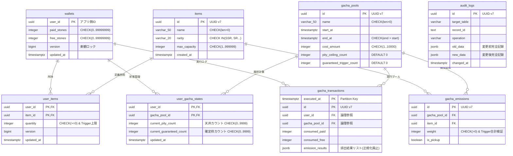

# 💎 Ultimate Gacha System – DDD実践プロジェクト (WIP)

**AI時代に生き残るための「DDD設計力」を鍛えるバックエンド実装**

[](https://openjdk.org/)
[](https://spring.io/projects/spring-boot)
[](https://www.postgresql.org/)
[](LICENSE)

## 📖 目次
- [プロジェクト概要](#プロジェクト概要)
- [なぜDDDなのか？ – AI時代に求められる本質](#なぜdddなのか--ai時代に求められる本質)
- [設計思想 & アーキテクチャ](#設計思想--アーキテクチャ)
- [主要ドメインモデル（DDD視点）](#主要ドメインモデルddd視点)
- [ER図](#er図)
- [技術スタック](#技術スタック)
- [セットアップ & 実行](#セットアップ--実行)
- [現在のステータス](#現在のステータス)
- [著者 / モチベーション](#著者--モチベーション)

## 🚀 プロジェクト概要

本プロジェクトは、**Domain-Driven Design (DDD)** を徹底的に実践したソーシャルゲーム向けガチャシステムのバックエンドです。  
単なる機能実装ではなく、以下のDDDの核心をコードで体現することを目的としています：

- **ユビキタス言語** をコードに落とし込み、ビジネスドメインを正確に表現
- **集約（Aggregate）** 内で不変条件（Invariant）を強制的に守る
- **値オブジェクト（Value Object）** で型安全 + 意味のあるドメイン概念を表現
- **Result型** によるRailway Oriented Programmingで例外に頼らない制御フロー

生成AIがコードを爆速で書ける時代に**「AIが出せないドメイン設計力」** が差別化の鍵になると考えています。  
このシステムは、金融システム並みのデータ整合性を目指し、保守性の高いコードベースを構築しています。

## 💡 なぜDDDなのか？ – AI時代に求められる本質

- AIはCRUDやテンプレートコードを完璧に生成するが、**「ビジネス文脈を読み取り、不変条件をコードに落とし込む」** ことはまだ苦手。
- DDDは**「ドメインを深く理解し、モデル化する力」** を要求する → これこそAIに代替されにくいスキル。
- 本プロジェクトは、**「なぜこの設計にしたのか」を常に語れるエンジニアになるための訓練場** です。  
  特に、ガチャの「天井カウント」「優先消費ルール」「排出確率の整合性」といった複雑なビジネスルールを、DDDの集約と値オブジェクトで表現しています。

## 🏗️ 設計思想 & アーキテクチャ

### 1. DDDの核心を実践
- **集約 (Aggregate)**: `GachaState`、`Wallet` などのルートエンティティ内で状態遷移と不変条件を完結。集約の境界を明確にし、トランザクションの範囲を最小化。
- **値オブジェクト (Value Object)**: `Gems`、`Money`、`RequestId` などで型安全 + 不変性を確保。負値やオーバーフローをコンパイルレベルで防ぐ。
- **ユビキタス言語**: メソッド名・クラス名にドメイン語をそのまま反映（`updateState`, `isPityReached`, `consume` など）。ビジネス側との共通言語をコードに反映。
- **防御的ドメイン設計**: DBレイヤー（CHECK制約・トリガー）とコードレイヤー（ガード節）の両面で不変条件を保護。

### 2. Railway Oriented Error Handling (Resultパターン)
例外による制御フローを避け、失敗を値として明示的に扱う。DDDの不変条件違反を型安全に伝播。

```java
// Wallet.java (Aggregate Root)
public Result<Wallet> consume(int amount) {
    return Gems.of(paid, free)
        .flatMap(gems -> gems.subtract(amount))
        .map(subtracted -> {
            this.paid = subtracted.paid();
            this.free = subtracted.free();
            return this;
        });
}

3. Defensive Domain Modeling（防御的ドメイン設計）「ありえない状態」をコードで表現させない。java

// GachaState.java (Aggregate Root)
public Result<GachaState> updateState(boolean isSsrEmitted, GachaPool pool) {
    int nextPity = isSsrEmitted ? 0 : this.currentPityCount + 1;
    
    // 不変条件: 天井を超えない
    if (pool.getPityCeiling() > 0) {
        nextPity = Math.min(nextPity, pool.getPityCeiling());
    }
    
    this.currentPityCount = nextPity;
    return Result.success(this);
}
```

 主要ドメインモデル（DDD視点）Gems (Value Object)
有償/無償の優先消費ルールをカプセル化。負値・オーバーフロー防止。
GachaState (Aggregate Root)
ユーザーごとの天井・確定枠進捗を管理。状態遷移をEntity内で完結。
Wallet (Aggregate Root)
石の残高管理。有償優先消費 + オーバーフローガード。
InventoryItem (Entity)
排出アイテムの数量管理。上限超過防止。
RequestId (Value Object)
冪等性キー（UUID v7）でログ追跡・重複防止。

 ER図詳細なER図は以下の通りです。DDDの集約境界を考慮したテーブル設計を採用しています。mermaid

## 技術スタックLanguage: 
- Java 21 (record, sealed interface, pattern matching)
- Framework: Spring Boot 4.0.1
- Database: PostgreSQL (with Stored Procedures, Triggers, CHECK Constraints)
- Architecture: Domain-Driven Design (DDD) / Hexagonal Architecture
- Error Handling: Result Pattern (Railway Oriented Programming)
- Concurrency: Java 21 Virtual Threads

 セットアップ & 実行前提条件: Docker & Docker Compose, JDK 21bash

# 1. リポジトリのクローン
git clone https://github.com/Emukei555/gacha_system.git
cd gacha_system

# 2. データベースの起動 (Docker)
docker-compose up -d

# 3. アプリケーションのビルド & 起動
./gradlew bootRun

 現在のステータス (WIP)Core Domain: Wallet, Money, RequestId, GachaState
Shared Kernel: Result<T>, ErrorCode
Application Service: ガチャ実行トランザクション
API Layer: REST Controller
Infrastructure: Repository Impl

 著者 / モチベーションAuthor: Emukei555 (17歳 / 高校2年生 / バックエンド志望)このプロジェクトは、生成AIがコードを書ける時代に**「なぜその設計にしたのか」**を語れるエンジニア**になるための実験です。
DDDを通じて、ドメインの意味をコードに落とし込み、AIの出力すら批判的に検証できる力を 鍛えています。

