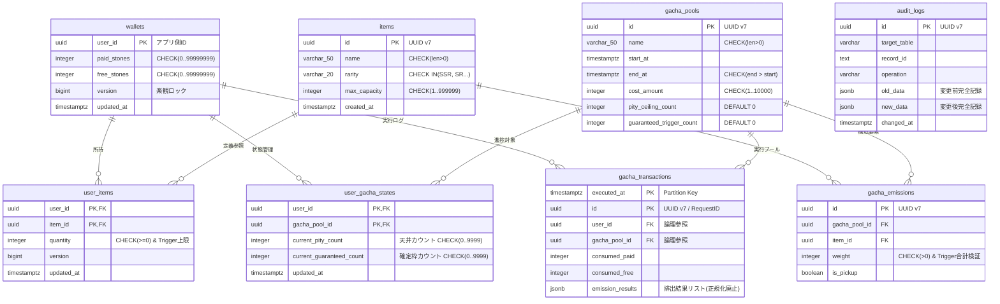

# Gacha System Implementation (DDD Practice)

Java 21 と Spring Boot 3.x/4.x を活用し、ドメイン駆動設計（DDD）の実践を目的とした堅牢なガチャシステムのリファレンス実装です。

## 🎯 プロジェクトの目的
「17歳、高校2年生でバックエンドエンジニアを目指す」という目標に向け、実務レベルの設計・実装スキルを証明するためのポートフォリオです。単に動くだけでなく、金融システム並みのデータ整合性と、保守性の高いコードベースを目指しています。

## 🛠 技術スタック
- **Language:** Java 21 (record, sealed interface, pattern matching)
- **Framework:** Spring Boot 4.0.1
- **Database:** PostgreSQL (with Stored Procedures, Triggers, CHECK Constraints)
- **Architecture:** Domain-Driven Design (DDD) / Hexagonal Architecture
- **Error Handling:** Result Pattern (Railway Oriented Programming)

## ✨ 設計のこだわり

### 1. 不変条件の徹底的な保護
ドメインモデル（Entity/VO）とDBレイヤー（CHECK制約・トリガー）の両面でガードを固めています。
- 「ウォレット残高が負にならない」
- 「ガチャの排出確率合計が厳密に100%（10000/10000）である」
といったビジネスルール（不変条件）をシステム全体で保証します。

### 2. Result パターンによる型安全なエラーハンドリング
例外（Exception）を投げっぱなしにするのではなく、`Result<T>` 型を戻り値として使用しています。
これにより、呼び出し側はコンパイルレベルで「成功」と「失敗」の両方のハンドリングを強制され、不当な状態のまま処理が続行される（不変条件が壊れる）ことを物理的に防ぎます。

### 3. 誤差ゼロの整数ウェイト抽選アルゴリズム
浮動小数点数（float/double）を一切使わず、整数（Weight）による累積減算方式を採用しています。
これにより、計算誤差による確率の不整合を排除した、公平で正確な抽選を実現しています。

## 📂 パッケージ構成 (DDD)
```text
src/main/java/com/yourcompany/
├── domain/                # ドメイン層 (ビジネスロジックの核)
│   ├── model/             # Entity, Value Object, Aggregate Root
│   ├── service/           # Domain Services (LotteryService等)
│   ├── shared/            # Result型, 共通ErrorCode
│   └── repository/        # Repository Interfaces
├── application/           # アプリケーション層 (ユースケース)
├── infrastructure/        # インフラストラクチャ層 (DB実装, API通信)
└── web/                   # プレゼンテーション層 (Controller, GlobalExceptionHandler)
```

## ER図

------------------------------------------------------------

```mermaid
erDiagram
    %% ユーザー資産（Aggregate Root）
    WALLETS {
        UUID user_id PK "アプリ生成UUID"
        INTEGER paid_stones "CHECK (>= 0)"
        INTEGER free_stones "CHECK (>= 0)"
        BIGINT version "楽観的ロック"
        TIMESTAMP_WITH_TIME_ZONE updated_at
    }

    %% アイテムマスタ
    ITEMS {
        UUID id PK "gen_random_uuid()"
        VARCHAR name "NOT NULL"
        VARCHAR rarity "COMMON-RARE等"
        INTEGER max_capacity "CHECK (> 0)"
        TIMESTAMP_WITH_TIME_ZONE created_at
    }

    %% ガチャプール（Aggregate Root）
    GACHA_POOLS {
        UUID id PK "gen_random_uuid()"
        VARCHAR name "NOT NULL"
        TIMESTAMP_WITH_TIME_ZONE start_at "NOT NULL"
        TIMESTAMP_WITH_TIME_ZONE end_at "NOT NULL"
        INTEGER cost_amount "CHECK (> 0)"
        INTEGER pity_ceiling_count "DEFAULT 300"
        INTEGER guaranteed_trigger_count "DEFAULT 0"
    }

    %% 排出定義
    GACHA_EMISSIONS {
        UUID id PK "gen_random_uuid()"
        UUID gacha_pool_id FK
        UUID item_id FK
        INTEGER weight "CHECK (> 0)"
        BOOLEAN is_pickup
        VARCHAR unique_constraint "UNIQUE(pool_id, item_id)"
    }

    %% ユーザー所持アイテム
    USER_ITEMS {
        UUID user_id PK,FK
        UUID item_id PK,FK
        INTEGER quantity "CHECK (>= 0)"
        BIGINT version
        TIMESTAMP_WITH_TIME_ZONE updated_at
    }

    %% ユーザーごとのガチャ状態
    USER_GACHA_STATES {
        UUID user_id PK,FK
        UUID gacha_pool_id PK,FK
        INTEGER current_pity_count "CHECK (>= 0)"
        INTEGER current_guaranteed_count "CHECK (>= 0)"
        BIGINT version
        TIMESTAMP_WITH_TIME_ZONE updated_at
    }

    %% ガチャ実行トランザクション（履歴）
    GACHA_TRANSACTIONS {
        UUID id PK "RequestID"
        TIMESTAMP_WITH_TIME_ZONE executed_at PK "Partition Key"
        UUID user_id FK
        UUID gacha_pool_id FK
        INTEGER consumed_paid_stones
        INTEGER consumed_free_stones
    }

    %% 排出結果詳細
    GACHA_TRANSACTION_DETAILS {
        UUID id PK
        TIMESTAMP_WITH_TIME_ZONE transaction_executed_at PK
        UUID transaction_id FK
        UUID item_id FK
        VARCHAR emission_type "NORMAL/PITY等"
        INTEGER item_order
    }

    %% 監査ログ
    AUDIT_LOGS {
        UUID id PK
        VARCHAR table_name
        UUID record_id
        VARCHAR operation "INSERT/UPDATE等"
        TIMESTAMP_WITH_TIME_ZONE changed_at
        VARCHAR changed_by
        JSONB old_data
        JSONB new_data
    }

    %% 関係性
    WALLETS ||--o{ USER_ITEMS : "owns"
    WALLETS ||--o{ USER_GACHA_STATES : "has state"
    WALLETS ||--o{ GACHA_TRANSACTIONS : "executes"
    ITEMS ||--o{ GACHA_EMISSIONS : "emitted by"
    ITEMS ||--o{ USER_ITEMS : "owned as"
    ITEMS ||--o{ GACHA_TRANSACTION_DETAILS : "obtained"
    GACHA_POOLS ||--o{ GACHA_EMISSIONS : "contains"
    GACHA_POOLS ||--o{ USER_GACHA_STATES : "tracked by"
    GACHA_POOLS ||--o{ GACHA_TRANSACTIONS : "executed on"
    GACHA_TRANSACTIONS ||--o{ GACHA_TRANSACTION_DETAILS : "contains"


